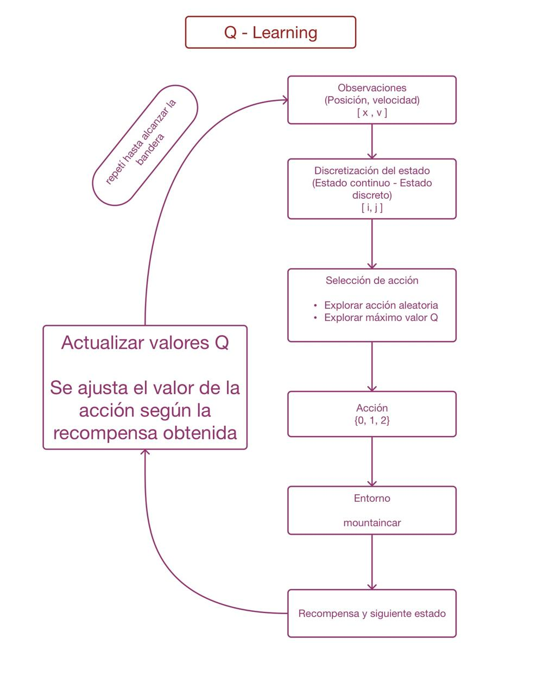
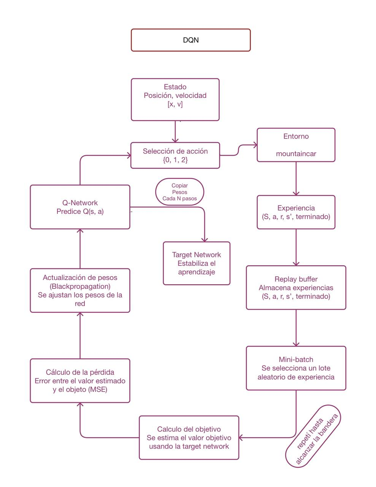

# MountainCar - Q-Learning y DQN

Repositorio práctico para comprender cómo funcionan los algoritmos de Aprendizaje por Refuerzo.

El proyecto implementa y analiza dos agentes sobre el entorno [MountainCar-v0](https://gymnasium.farama.org/environments/classic_control/mountain_car/):

- Q-Learning
- Deep Q-Network (DQN)

## 1. Entorno MountainCar-v0

MountainCar representa un automóvil ubicado en un valle. El motor no tiene suficiente potencia para subir directamente la pendiente, por lo que debe desplazarse hacia ambos lados para generar impulso y alcanzar la bandera.

El objetivo es llegar a la posición `0.5`.

### Estado

| Índice | Variable | Descripción | Rango |
|:---:|---|---|---|
| 0 | position | Posición del automóvil | -1.2 a 0.6 |
| 1 | velocity | Velocidad del automóvil | -0.07 a 0.07 |

### Acciones

| Valor | Acción |
|:---:|---|
| 0 | Acelerar a la izquierda |
| 1 | No acelerar |
| 2 | Acelerar a la derecha |

### Recompensa

El agente recibe `-1` por cada paso.

El episodio termina cuando el automóvil alcanza la bandera o llega al límite de pasos.

Por lo tanto, una recompensa menos negativa representa un mejor resultado.

---

## 2. Instalación

El proyecto utiliza `uv` para gestionar las dependencias.

```bash
uv sync
```

---

## 3. Uso

Los comandos principales del proyecto son:

| Comando | Descripción |
|---|---|
| `version` | Muestra la versión del proyecto |
| `list` | Lista los agentes disponibles |
| `inspect` | Inspecciona el entorno |
| `init <agent>` | Inicializa un agente |
| `train <agent>` | Entrena un agente |
| `load <agent>` | Carga y evalúa un agente |
| `sim <agent>` | Ejecuta episodios paso a paso |
| `render <agent>` | Visualiza los episodios |
| `delete <agent>` | Elimina el modelo guardado |

Ejemplo:

```bash
uv run mountaincar train qlearning --episodes 20000
uv run mountaincar load qlearning --eval
uv run mountaincar render qlearning --episodes 3
```

---

## 4. Ejercicio 1 - Implementación de Q-Learning

El primer ejercicio consistió en completar las partes principales del agente Q-Learning en:

```text
src/mountain_car/agents/qlearning.py
```

Se implementaron:

- Discretización del estado.
- Selección de acciones.
- Actualización de la Q-Table.

### 4.1 Discretización

Como MountainCar tiene estados continuos, la posición y la velocidad se convierten en valores discretos para poder utilizarlos en la Q-Table.

```python
return tuple(
    int(np.digitize(value, bins))
    for value, bins in zip(obs, self._bins)
)
```

Prueba realizada:

```text
Entrada: [-0.5, 0.0]
Salida:  (7, 10)
```

### 4.2 Selección de acciones

Se implementó una estrategia epsilon-greedy:

```python
if not deterministic and np.random.random() < self.epsilon:
    return int(np.random.randint(self.n_actions))

return int(np.argmax(self.q_table[state]))
```

Esto permite alternar entre exploración y explotación.

Prueba realizada:

```text
Acción exploratoria: 2
Acción explotada: 0
Acción determinista: 0
```

### 4.3 Actualización de la Q-Table

Para estados terminales se utiliza únicamente la recompensa:

```python
if terminated:
    target = reward
```

Para estados no terminales:

```python
else:
    target = reward + self.gamma * np.max(self.q_table[next_state])
```

La actualización se realiza mediante:

```python
self.q_table[state][action] += self.lr * (
    target - self.q_table[state][action]
)
```

Prueba realizada:

```text
Q antes: 0.0
Q después: -0.1
```

---

## 5. Entrenamiento de Q-Learning

El agente se entrenó durante 20.000 episodios:

```bash
uv run mountaincar train qlearning --episodes 20000
```

Resultado de evaluación:

```text
Episodes trained : 20000
States visited   : 294 / 400
Epsilon          : 0.0100
LR / Gamma       : 0.1 / 0.99

Mean reward: -134.80 +/- 7.74
Reached the flag: 10/10 episodes
```

### Visualización

Se ejecutaron tres episodios:

```bash
uv run mountaincar render qlearning --episodes 3
```

Resultados:

```text
Episode 1: -142
Episode 2: -140
Episode 3: -134
```

Los tres episodios alcanzaron la bandera.

---

## 6. Diagrama del proceso de Q-Learning

### Diagrama


---

## 7. Ejercicio 2 - Implementación de DQN

El segundo ejercicio consistió en implementar el agente Deep Q-Network en:

```text
src/mountain_car/agents/dqn.py
```

El DQN utiliza:

- Q-Network.
- Target Network.
- Replay Buffer.
- Mini-batches.
- Actualización mediante Bellman.

---

## 8. QNetwork

La red recibe las dos variables del estado y genera tres valores Q, uno por cada acción.

Arquitectura:

```text
Entrada (2)
     ↓
Linear 2 → 128
     ↓
ReLU
     ↓
Linear 128 → 128
     ↓
ReLU
     ↓
Linear 128 → 3
     ↓
Q-values
```

La prueba de la red produjo:

```text
Entrada: torch.Size([1, 2])
Salida: torch.Size([1, 3])
```

---

## 9. Replay Buffer

El Replay Buffer almacena las experiencias generadas por el agente:

```text
(state, action, reward, next_state, terminated)
```

Posteriormente se seleccionan mini-batches de experiencias para realizar el entrenamiento.

---

## 10. Proceso de aprendizaje DQN

El valor Q actual se obtiene de la Q-Network:

```python
current_q = self.q_net(states_t).gather(1, actions_t)
```

El siguiente valor Q se obtiene de la Target Network:

```python
with torch.no_grad():
    next_q = self.target_net(next_states_t).max(
        dim=1,
        keepdim=True
    ).values
```

El objetivo de Bellman es:

```python
target_q = rewards_t + self.gamma * next_q * (1.0 - terminateds_t)
```

Finalmente se calcula la pérdida y se actualiza la red:

```python
loss = self.loss_fn(current_q, target_q)

self.optimizer.zero_grad()
loss.backward()
self.optimizer.step()
```

Prueba realizada:

```text
Buffer: 65
Loss: aproximadamente 0.9999
Tipo: float
```

---

## 11. Uso de `terminated`

Se utilizó `terminated` para diferenciar un estado terminal real de un episodio que finaliza por límite de tiempo.

Esto permite realizar correctamente el cálculo del valor futuro en las transiciones que no representan un estado terminal.

---

## 12. Prueba del DQN en CartPole

Antes de analizar el comportamiento en MountainCar, el DQN fue probado en `CartPole-v1`.

Resultados:

```text
Episode 25/200  | Avg Reward: 19.16
Episode 50/200  | Avg Reward: 32.24
Episode 75/200  | Avg Reward: 127.84
Episode 100/200 | Avg Reward: 217.60
Episode 125/200 | Avg Reward: 212.08
Episode 150/200 | Avg Reward: 180.20
Episode 175/200 | Avg Reward: 191.72
Episode 200/200 | Avg Reward: 198.32
```

Esto permitió comprobar que el proceso de aprendizaje del DQN funcionaba en otro entorno.

---

## 13. Diagnóstico inicial de MountainCar

El primer entrenamiento del DQN en MountainCar permanecía alrededor de:

```text
-200
```

Por esta razón se realizaron pruebas adicionales para identificar el problema.

---

## 14. Prueba con acciones aleatorias

Se ejecutaron 300 episodios utilizando acciones aleatorias.

Resultado:

```text
Random agent successes: 0/300
```

Esto mostró la dificultad de encontrar una trayectoria exitosa mediante acciones completamente aleatorias.

---

## 15. Problema de exploración

MountainCar requiere realizar movimientos consecutivos hacia ambos lados para generar suficiente impulso.

Con una exploración independiente, el agente puede cambiar constantemente de acción y no mantener durante suficiente tiempo una dirección.

Por esta razón, se identificó la exploración como un punto importante para conseguir trayectorias que permitieran alcanzar la bandera.

---

## 16. Modificación de la exploración

Se implementó una exploración con acciones persistentes.

El agente mantiene una misma acción exploratoria durante varios pasos:

```python
self.exploration_action = None
self.exploration_steps = 0
self.exploration_horizon = 8
```

Ejemplo de acciones obtenidas:

```text
[2, 2, 2, 2, 2, 2, 2, 2,
 1, 1, 1, 1, 1, 1, 1, 1,
 2, 2, 2, 2, 2, 2, 2, 2,
 0, 0, 0, 0, 0, 0]
```

También se verificó que no se generaran acciones inválidas:

```text
¿Hay None?: False
```

---

## 17. Entrenamiento final del DQN

Después de modificar la exploración, se realizó nuevamente el entrenamiento:

```bash
uv run mountaincar train dqn --episodes 2500
```

Resultado final del entrenamiento:

```text
Episode 2500/2500
Avg Reward: -121.90
```

---

## 18. Evaluación final del DQN

La evaluación se realizó mediante:

```bash
uv run mountaincar load dqn --eval
```

Resultado:

```text
Episodes trained : 2500
Mean reward      : -108.90 +/- 14.16
Reached the flag : 10/10 episodes
```

---

## 19. Diagrama del proceso de DQN

### Diagrama



---

## 20. Resultados finales

| Agente | Episodios de entrenamiento | Recompensa media | Bandera |
|---|---:|---:|---:|
| Q-Learning | 20.000 | -134.80 ± 7.74 | 10/10 |
| DQN | 2.500 | -108.90 ± 14.16 | 10/10 |

### Resumen

- Q-Learning fue entrenado durante **20.000 episodios**.
- DQN fue entrenado durante **2.500 episodios**.
- Ambos agentes alcanzaron la bandera en los **10 episodios de evaluación**.
- El análisis del DQN permitió identificar la importancia de mantener acciones exploratorias durante varios pasos consecutivos.
- Se realizaron pruebas adicionales en CartPole y con acciones aleatorias para apoyar el diagnóstico.

---

## Estructura del proyecto

```text
mountain_car/
├── src/
│   └── mountain_car/
│       ├── cli.py
│       └── agents/
│           ├── qlearning.py
│           └── dqn.py
├── docs/
│   ├── qlearning.png
│   └── dqn.png
├── saves/
├── EXERCISES.md
├── README.md
└── pyproject.toml
```
## 21. Conclusiones

El desarrollo de este proyecto permitió implementar y analizar dos métodos de Aprendizaje por Refuerzo para resolver MountainCar-v0.

Q-Learning permitió trabajar con una representación discreta del estado mediante una Q-Table, mientras que DQN utilizó una red neuronal, Replay Buffer y Target Network para aproximar los valores Q.

Durante el desarrollo se identificó que MountainCar presenta un reto particular debido a su sistema de recompensas y a la necesidad de generar impulso mediante secuencias de acciones. El análisis realizado permitió ajustar la estrategia de exploración del DQN y mejorar su comportamiento.

Finalmente, ambos agentes lograron alcanzar la bandera durante los episodios de evaluación, obteniendo:

- **Q-Learning:** -134.80 ± 7.74, con 10/10 episodios exitosos.
- **DQN:** -108.90 ± 14.16, con 10/10 episodios exitosos.

El proyecto permitió comprobar de manera práctica cómo la representación del estado, la exploración y el proceso de aprendizaje influyen en el desempeño de un agente de Aprendizaje por Refuerzo.